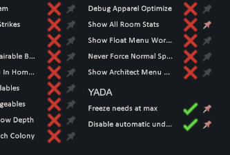
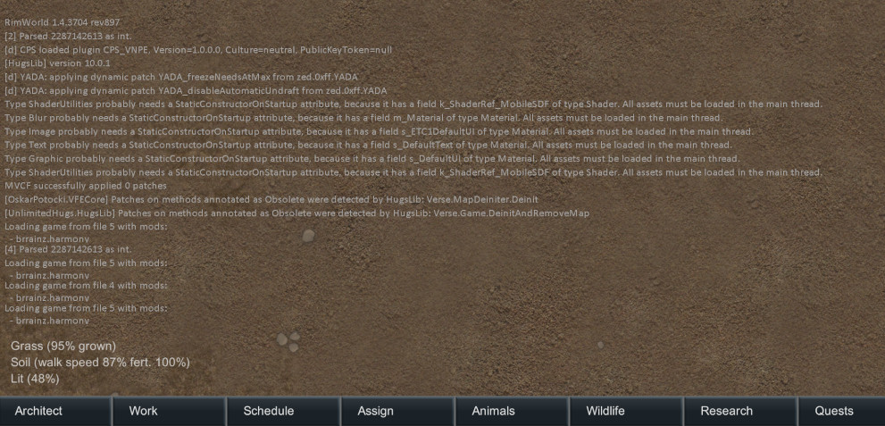

# YADA: Yet Another Dev Assistant

Supports **RimWorld 1.4**, **1.5**, and **1.6**. Build for one or all:

```bash
cd Source
# 1.4 (default) → outputs to 1.4/Assemblies/
dotnet build -c Release

# 1.5 → outputs to 1.5/Assemblies/
dotnet build -c Release -p:RimWorldVersion=1.5

# 1.6 → outputs to 1.6/Assemblies/
dotnet build -c Release -p:RimWorldVersion=1.6
```

For a single mod that works in all games, run all three so the mod has `1.4/Assemblies/YADA.dll`, `1.5/Assemblies/YADA.dll`, and `1.6/Assemblies/YADA.dll`; shared content (About, Defs, etc.) stays at the repo root.

## 0. XML Harmony patches!

So simple!

``` xml
<YADA.PatchDef>
    <defName>YADA_freezeNeedsAtHalf</defName>
    <className>Need</className>
    <methodName>get_CurLevel</methodName>
    <postfix>
      <setResult>0.5</setResult>
    </postfix>
</YADA.PatchDef>
```

Or a bit more complex:

``` xml
<YADA.PatchDef>
    <defName>YADA_freezeNeedsAtMax</defName>
    <label>Freeze needs at max</label>

    <className>Need</className>
    <methodName>get_CurLevel</methodName>
    <postfix>
      <arguments>
        <li>ref __result</li>
        <li>__instance</li>
      </arguments>
      <opcodes>
        <!-- checkbox code is added automagically -->
        <li>Ldarg_0</li>
        <li>Ldarg_1</li>
        <li>Callvirt RimWorld.Need::get_MaxLevel</li>
        <li>Stind_R4</li>
        <!-- ret is added automagically -->
      </opcodes>
    </postfix>

    <debugSettingsCheckbox/>
</YADA.PatchDef>
```

See the [Patches](Defs/Patches) dir for more examples.

I bet you've dreamt of writing the CIL opcodes in XML )) Can be done now!

And as a bonus you'd get a free checkbox if `<debugSettingsCheckbox/>` is there. Category and default value is configurable.



## 1. .rimignore

Now you can filter files you upload to Steam, similar to \[b\].gitignore\[/b\].

Add default [`.rimignore`](.rimignore) file to your mod with a single click.

## 2. mod size is now shown before upload


## 3. All dev flags are now saved with the game

Like "god mode", "unlimited power", all draw flags, etc etc.
Only if dev mode is on.


## 4. Add translucent debug log overlay

toggled by "§" key, totally configurable.



## 5. Hediff severity +/- buttons
standard ctrl/shift modifier keys are honored


## 6. Texture saver
Show "Save as filename.png" option when right-clicking any icon (e.g. in item's InfoCard)
(disabled by default, enable in mod settings)

Also available as a standalone tool in mod's settings.

## 7. Screenshots

## You may also like...

[](https://steamcommunity.com/sharedfiles/filedetails/?id=2957904090)
[](https://steamcommunity.com/sharedfiles/filedetails/?id=2961708299)
[](https://steamcommunity.com/sharedfiles/filedetails/?id=2958300354)

### Links:

* [Steam](https://steamcommunity.com/sharedfiles/filedetails/?id=2971543841)
* [GitHub](https://github.com/zed-0xff/RW-YADA)
* [Patreon](https://patreon.com/zed_0xff)
* [Ko-fi](https://ko-fi.com/zed_0xff)

License: MIT
