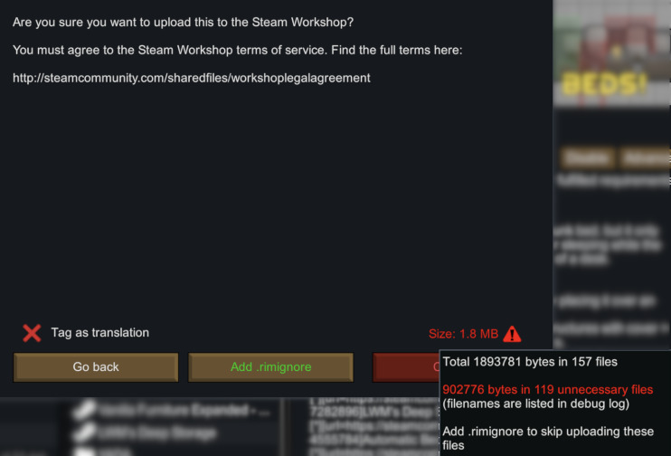
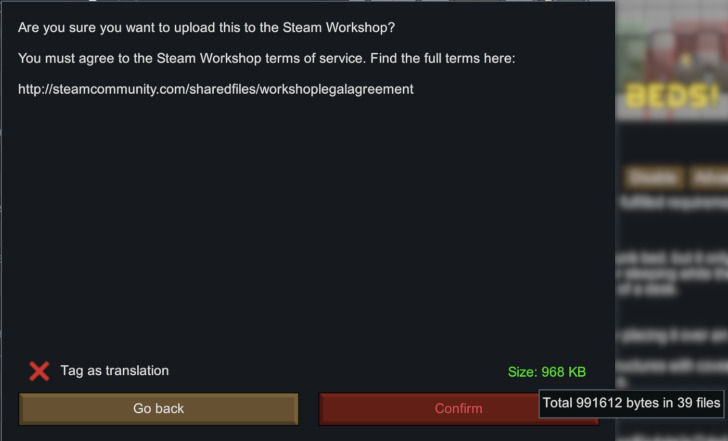
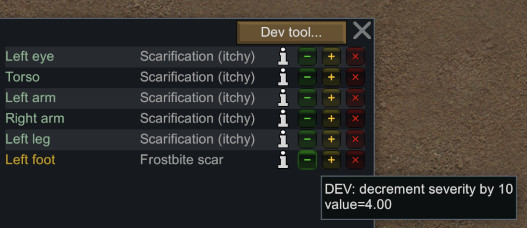

# YADA: Yet Another Dev Assistant

## 0. XML Harmony patches!

So simple!

    <YADA.PatchDef>
        <defName>YADA_freezeNeedsAtHalf</defName>
        <className>Need</className>
        <methodName>get_CurLevel</methodName>
        <postfix>
          <setResult>0.5</setResult>
        </postfix>
    </YADA.PatchDef>

Or a bit more complex:

    <YADA.PatchDef>
        <defName>YADA_freezeNeedsAtMax</defName>
        <label>Freeze needs at max</label>
    
        <className>Need</className>
        <methodName>get_CurLevel</methodName>
        <postfix>
          <arguments>
            <li>ref __result</li>
            <li>__instance</li>
          </arguments>
          <opcodes>
            <!-- checkbox code is added automagically -->
            <li>Ldarg_0</li>
            <li>Ldarg_1</li>
            <li>Callvirt RimWorld.Need::get_MaxLevel</li>
            <li>Stind_R4</li>
            <!-- ret is added automagically -->
          </opcodes>
        </postfix>
    
        <debugSettingsCheckbox/>
    </YADA.PatchDef>

See the mod's `Patches` dir for more examples.

I bet you've dreamt of writing the CIL opcodes in XML )) Can be done now!

## 1. .rimignore

Now you can filter files you upload to Steam, similar to \[b\].gitignore\[/b\].

Add default [`.rimignore`](.rimignore) file to your mod with a single click.

## 2. mod size is now shown before upload

## 3. All dev flags are now saved with the game

Like "god mode", "unlimited power", all draw flags, etc etc.
Only if dev mode is on.

## 4. Add translucent debug log overlay

toggled by "§" key, changeable

## 5. Hediff severity +/- buttons
standard ctrl/shift modifier keys are honored

### Links:

* [Steam](https://steamcommunity.com/sharedfiles/filedetails/?id=2971543841)
* [GitHub](https://github.com/zed-0xff/RW-YADA)
* [Patreon](https://patreon.com/zed_0xff)
* [Ko-fi](https://ko-fi.com/zed_0xff)
